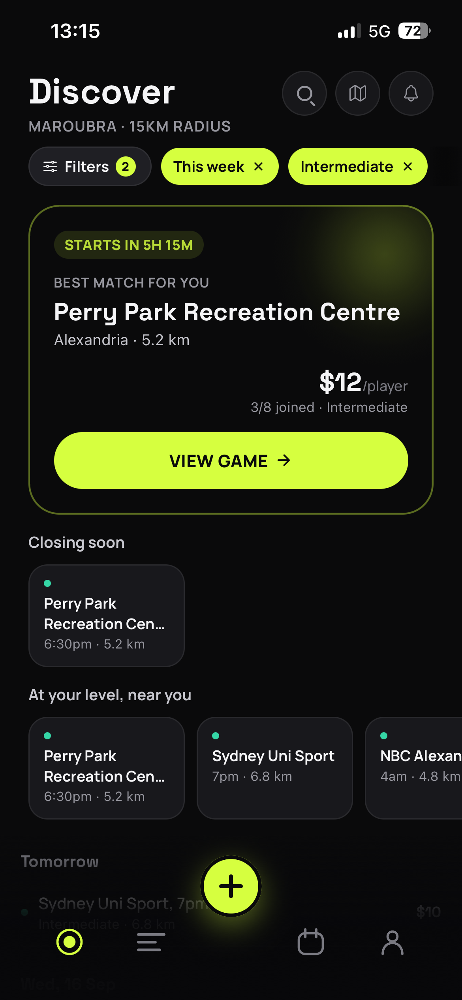
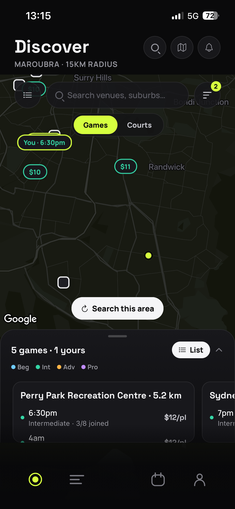
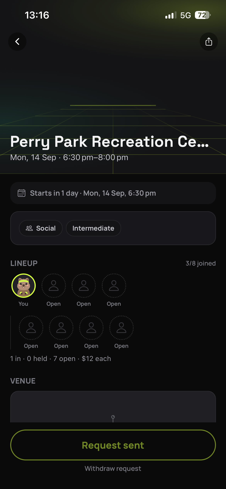
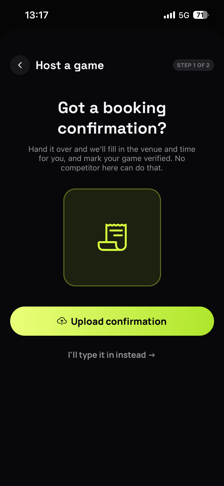
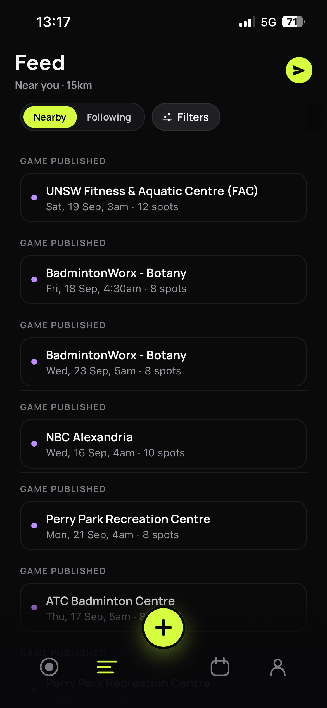
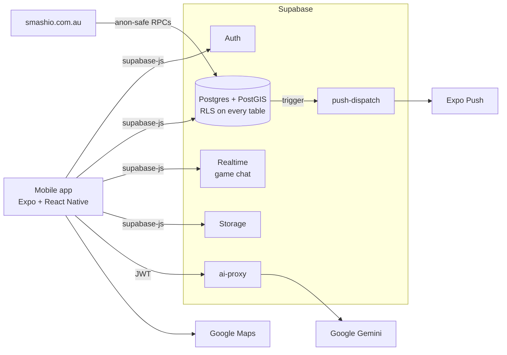

<div align="center">


# SMASHIO

**Got a court, short a player? Smashio fills it.**

Find people to play badminton with in Sydney, at your level, who actually turn up.

[](https://testflight.apple.com/join/cJMZQmbn)
[](https://smashio.com.au)
[](https://expo.dev)
[](https://supabase.com)
[](LICENSE)

[Website](https://smashio.com.au) · [Join the iOS beta](https://testflight.apple.com/join/cJMZQmbn) · [Developer guide](docs/README.md)

<br />







</div>

---

## Why

Most social badminton in Sydney is organised in group chats. Someone books a court, a player
drops out an hour before, and the host spams five chats hoping to fill the spot with someone who
isn't wildly over or under their level.

SMASHIO is built around that one moment. A host posts the game, nearby players at the right
level get a ping, and trust signals tell everyone what they're walking into. It is a
player-matching app, not a court-booking app: the venue is a detail on the game.

## Features

- **Spot alerts.** When a spot opens, nearby players at the right level get a push they can
  answer with "Ask to join" straight from the notification.
- **Trust you can see.** Every game shows whether the court is booked (the host's booking
  confirmation is checked), the level voted by people who've played with them, and the host's
  turn-up rate.
- **Discover.** A list and a Google Maps view of games and courts near you, filtered by level,
  day and distance, with a "best match" pick up top.
- **Host in under a minute.** Upload a booking confirmation and the venue, time and court fill
  themselves in. Hold spots for mates, invite by name, set visibility.
- **Game chat.** Every game gets its own real-time chat, with host broadcast mode and a pinned
  game card.
- **After the game.** Hosts mark attendance and no-shows. Players rate each other and vote on
  level, and reputation is only ever shown in aggregate.
- **Feed and clubs.** "Looking for players" and question posts from people nearby or people you
  follow, with up to four photos, replies and reactions. Text and photos are checked by an AI
  moderator before they go live.
- **Venue directory.** 75 Sydney badminton venues with courts, pricing and amenities.
- **Smashimals.** 28 illustrated animal avatars, plus a small cast who show up when a screen is
  empty.

## How it's built

| Layer | Tech |
|---|---|
| App | React Native 0.86, Expo SDK 57, Expo Router, TypeScript (strict) |
| UI | NativeWind, Reanimated 4, Space Grotesk |
| State | TanStack Query for server cache, Zustand for UI state |
| Backend | Supabase: Postgres + PostGIS, Auth, Realtime, Storage, Edge Functions (Deno) |
| Maps | Google Maps (`react-native-maps`) with a cloud-styled brand map style |
| AI | Google Gemini, called server-side only through the `ai-proxy` Edge Function |
| Push | Expo Push to APNs / FCM, dispatched from Postgres triggers |
| Website | Static HTML plus Vercel serverless functions for SEO pages ([`website/`](website/)) |
| Release | Self-hosted GitHub Actions builds to TestFlight and Play; EAS Update for OTA |



A few decisions that shape the code:

- **Sport is data, not code.** Badminton ships first, but sports, levels and formats live in
  config tables so the engine can take more sports without a rewrite.
- **The database is the API.** The client talks to Postgres directly, and row-level security
  plus `security definer` RPCs decide what anyone can see. Anonymous website pages get their own
  column-allowlisted RPCs.
- **No LLM keys on the device.** Booking-confirmation parsing and text and image moderation run
  in an Edge Function.
- **One vendor for realtime.** Chat is Supabase Realtime, not a third-party chat SDK.

## Run it locally

You'll need Node 22, Docker, the [Supabase CLI](https://supabase.com/docs/guides/cli/getting-started)
and Xcode (iOS Simulator) or Android Studio (emulator). `npm run ios` / `android` make a native dev build, not Expo Go.

```bash
git clone https://github.com/smashioapp/smashio-app.git && cd smashio-app
supabase start          # Postgres, Auth, Realtime, Storage, Edge Functions in Docker
supabase db reset       # run migrations, then seed.sql
cd ui && npm install
npm run ios             # or: npm run android
```

`ui/.env` already points at the local stack, so there's nothing to configure. Sign in with
`test@smashio.dev` (password in [`supabase/seed.sql`](supabase/seed.sql)). Map tiles and venue
search need a Google Maps key; everything else works without one.

The [developer guide](docs/README.md) covers environment variables, Edge Functions, deploying,
store builds and the full index of design and product docs.

## Repo layout

```
ui/          Expo app: routes in app/, components/, lib/ (Supabase client, queries, store)
supabase/    migrations/ (schema, RLS, RPCs), functions/ (Edge Functions), seed.sql
website/     smashio.com.au, static HTML + Vercel API routes for SEO pages
brand/       logo master and icon generation scripts
docs/        product, design and engineering plans
```

## Status

Private beta in Sydney. iOS via [TestFlight](https://testflight.apple.com/join/cJMZQmbn), Android
via Play internal testing (invite only for now, leave your email at
[smashio.com.au](https://smashio.com.au)). Public launch on both stores is planned for
November 2026.

## Contributing

This is a small, independent product and we're not accepting pull requests. Bug reports and
ideas are very welcome, open an [issue](https://github.com/smashioapp/smashio-app/issues) or
email hello@smashio.com.au.

## License

The source is public so you can read it and learn from it. It is not open source: all rights
are reserved and you may not reuse, redistribute or deploy it. See [LICENSE](LICENSE).
The SMASHIO name, logo and Smashimals artwork are brand assets of SMASHIO and are not covered by any permission to view the code.
