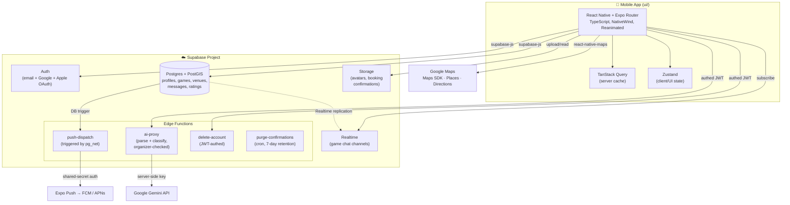

# SMASHIO

Player-matching app for the Australian market — Playo (India) style, multi-sport engine under the hood, badminton first. Core action is finding/matching with players for a game; venue is a detail on the game, not the product (SMASHIO is not a venue-booking app).

- **Platform**: iOS/Android only (React Native + Expo). No in-app web — smashio.com.au ([website/](website/)) is marketing, store links, and read-only SEO/share pages for games, venues and clubs. Nothing on the web lets you join or host.
- **UI direction**: CRED-style — dark theme, high creative/premium UX.
- **Status**: ABN registered (sole trader), backend fully built and live, in **private beta** (Sydney, iOS via TestFlight only — Android has not shipped yet; Play Store listing and device verification still in progress as at 2026-09-07). Core loop plus Discover, My Games, bottom nav, and the Google-Maps-backed map are all rebuilt and shipped; in-app account deletion is live. See [docs/backend-plan.md](docs/backend-plan.md), [docs/ux-plan.md](docs/ux-plan.md), and the [Docs](#docs) section below for what's still open.
- **Since that status was written** (2026-08-12): a venue directory (56 venues), a social feed with follows and clubs, a reworked post-game/ratings flow, Host a Game v3, Profile & Settings v3, notifications with an activity inbox, and a new brand mark. The nav is now `Discover | Feed | My Games | Profile` — Chat merged into My Games. See the fuller [Docs](#docs) list below.

## Architecture



**Why this shape**: sport is config, not hardcode (badminton ships first, engine assumes more sports later); AI calls are always server-side via `ai-proxy` — the client never holds an LLM key; chat is built in-house on Supabase Realtime rather than a third-party chat SDK, to keep a single vendor. The Discover map runs on Google Maps (`PROVIDER_GOOGLE`) on both platforms — iOS no longer falls back to Apple Maps. The cloud-styled brand Map ID is applied on **iOS only** (`GameMap.tsx` passes `googleMapId` under `Platform.OS === "ios"`); Android renders Google's default styling until an Android-restricted Maps key exists. See [docs/map-plan.md](docs/map-plan.md).

## Repo layout

```
smashio-app/
├── ui/                  # Expo Router app (React Native, TypeScript)
│   ├── app/             # File-based routes: (tabs), game, chat, wizard, onboarding, post-game,
│   │                    #   venue(s), player, post, compose, settings/*, notifications
│   ├── components/      # Shared UI components
│   ├── lib/             # Supabase client, query hooks, stores, helpers
│   ├── .maestro/        # Maestro e2e flows (run via scripts/e2e.sh)
│   └── app.config.js    # Expo app config (icons, plugins, permissions)
├── supabase/            # Backend: Postgres schema, Edge Functions, config
│   ├── migrations/      # Ordered SQL migrations (schema, RLS, RPCs)
│   ├── functions/       # ai-proxy, push-dispatch, delete-account, purge-confirmations
│   └── seed.sql         # Local dev seed data (reference tables, venues, test accounts, games)
├── website/             # Marketing site (smashio.com.au) — static HTML, no build step, plus
│   └── api/             #   Vercel serverless functions server-rendering /game/:id, /venue/:slug,
│                        #   /club/:slug, /sydney, /sitemap.xml. Still no in-app functionality on web.
└── docs/                # Product/tech/business docs (read before proposing features)
```

## Prerequisites

| Tool | Version | Notes |
|---|---|---|
| [Node.js](https://nodejs.org/) | 22.x | matches CI — all four workflows pin `node-version: 22` (bumped from 20 in `fd88f34`) |
| npm | 10.x+ | ships with Node 22 |
| [Docker Desktop](https://www.docker.com/products/docker-desktop/) | latest | required to run Supabase locally |
| [Supabase CLI](https://supabase.com/docs/guides/cli/getting-started) | latest | `npm install -g supabase` |
| [Expo Go](https://expo.dev/go) app (iOS/Android) | latest | or an iOS Simulator / Android emulator for native testing |
| [Google Cloud](https://console.cloud.google.com/) account | — | only needed for Maps/Places API key + Google OAuth |

## 1. Clone

```bash
git clone https://github.com/smashioapp/smashio-app.git
cd smashio-app
```

## 2. Backend — Supabase (local)

Local Supabase runs the full stack (Postgres, Auth, Realtime, Storage, Edge Functions) in Docker — no hosted project needed to develop.

```bash
supabase start
```

First run pulls Docker images and prints local URLs + keys (API URL, anon key, service-role key, Studio URL). Keep this terminal output — the app's `.env` needs the API URL and anon key.

Apply migrations and seed data:

```bash
supabase db reset
```

This runs every file in `supabase/migrations/` in order, then `supabase/seed.sql` (reference tables, sample venues, dev fixtures).

Optional — Google OAuth locally (only needed to test "Sign in with Google"):

```bash
cp .env.example .env   # then fill in SUPABASE_AUTH_GOOGLE_CLIENT_ID / _SECRET
```

Edge Function secrets (`ai-proxy`, `push-dispatch`) are provisioned separately — see [Edge Functions](#edge-functions) below.

## 3. Mobile app — Expo

```bash
cd ui
npm install
cp .env.example .env
```

Edit `ui/.env`:

| Variable | Required | Where to get it |
|---|---|---|
| `EXPO_PUBLIC_SUPABASE_URL` | Yes | printed by `supabase start` (defaults to `http://127.0.0.1:54321`) |
| `EXPO_PUBLIC_SUPABASE_ANON_KEY` | Yes | printed by `supabase start` — same key on every machine for local dev |
| `EXPO_PUBLIC_SENTRY_DSN` | No | blank disables Sentry locally |
| `EXPO_PUBLIC_GOOGLE_MAPS_API_KEY` | No* | Google Cloud Console — enable Maps SDK for iOS/Android + Places API. Blank = grey map tiles on **both** platforms and no venue search results in the create wizard (Discover's map runs on Google Maps with a cloud-styled brand Map ID, not Apple Maps — see [docs/map-plan.md](docs/map-plan.md)) |

\* Not required to boot the app; required for map tiles and venue search in the game-creation wizard. The current key is iOS-restricted only (bundle `com.smashio.app`) — Android has no Play Store build yet, don't loosen the iOS key to cover it, provision a second Android-restricted key instead.

Run it:

```bash
npm start        # Expo dev server — scan QR with Expo Go, or press i / a
npm run ios       # open iOS Simulator directly
npm run android   # open Android emulator directly
npm run web       # experimental web preview (not a shipped platform)
```

## Edge Functions

| Function | Trigger | Secrets needed |
|---|---|---|
| `ai-proxy` | called by the client with the caller's session JWT | `SUPABASE_URL`, `SUPABASE_ANON_KEY`, `SUPABASE_SERVICE_ROLE_KEY`, `GEMINI_API_KEY` |
| `push-dispatch` | invoked only by Postgres (`pg_net` trigger/cron), not user-facing | `SUPABASE_URL`, `SUPABASE_SERVICE_ROLE_KEY`, `PUSH_DISPATCH_KEY` (shared secret, not a Supabase JWT) |
| `delete-account` | called by the client with the caller's session JWT (Profile → Delete account) | `SUPABASE_URL`, `SUPABASE_SERVICE_ROLE_KEY` |

Local Supabase auto-injects `SUPABASE_URL`/`SUPABASE_ANON_KEY`/`SUPABASE_SERVICE_ROLE_KEY`. Set the rest with:

```bash
supabase secrets set GEMINI_API_KEY=...
supabase secrets set PUSH_DISPATCH_KEY=<random-shared-secret>
```

Serve functions locally alongside `supabase start`:

```bash
supabase functions serve
```

## Deploying to a hosted Supabase project

```bash
supabase link --project-ref <your-project-ref>
supabase db push                      # apply migrations
supabase functions deploy ai-proxy push-dispatch delete-account purge-confirmations
supabase secrets set GEMINI_API_KEY=... PUSH_DISPATCH_KEY=...
```

Then point `ui/.env.production` at the hosted project's URL + anon key (`ui/.env` stays on the local Docker stack — real device/store builds load `.env.production` automatically, forced by Expo's production bundling mode), and provision the Google OAuth client + Maps API key for production (restrict by package name + SHA-1 before shipping — see inline comments in `ui/.env.example`).

## App store builds

**Builds run in self-managed GitHub Actions, not EAS** (changed 2026-08-15, `38c3729` onward — corrected here 2026-09-07).

| Workflow | Trigger | What it does |
|---|---|---|
| [.github/workflows/build-ios.yml](.github/workflows/build-ios.yml) | `workflow_dispatch`, or a published GitHub release | `expo prebuild` → archive → export → upload to TestFlight via `fastlane pilot` |
| [.github/workflows/build-android.yml](.github/workflows/build-android.yml) | `workflow_dispatch` (choose `apk` or `aab`) | `expo prebuild` → Gradle release build, signed with the release keystore from repo secrets |
| [.github/workflows/ci.yml](.github/workflows/ci.yml) | push to `main` | typecheck, unit tests, `supabase db reset` |
| [.github/workflows/ota-update.yml](.github/workflows/ota-update.yml) | push to `main` touching `ui/**` | `eas update` — **EAS is still used for OTA JS updates**, just not for builds |

Build numbers are `GITHUB_RUN_NUMBER + 1000` in both build workflows, offset past the range the EAS era already burned in App Store Connect.

[ui/eas.json](ui/eas.json) still exists and carries both iOS and Android submit config, but neither `eas build` nor `eas submit` is part of the release path. See [docs/store-readiness-plan.md](docs/store-readiness-plan.md) for the remaining store-submission blockers, and its "iOS runner image / Xcode / expo-modules-jsi" section **before** touching any of those three — a green iOS build does not prove the app launches.

## Docs

- [docs/mvp-spec.md](docs/mvp-spec.md) — MVP feature flow
- [docs/business-context.md](docs/business-context.md) — entity, naming, market context
- [docs/tech-stack.md](docs/tech-stack.md) — stack decisions + rationale
- [docs/backend-plan.md](docs/backend-plan.md) — backend build plan (all 10 slices shipped, live in production)
- [docs/ux-plan.md](docs/ux-plan.md) — app-wide UX/motion polish phases (shipped)
- [docs/not-boring-plan.md](docs/not-boring-plan.md) — CRED/(Not Boring)-style feel pass: haptics, sound, hold-to-join (phases 0–3 shipped, phase 4 "season ladder" parked)
- [docs/discover-plan.md](docs/discover-plan.md) — Discover tab rebuild: trust, filters, rails, map-as-layer (shipped)
- [docs/my-games-plan.md](docs/my-games-plan.md) — My Games rebuild: single agenda, day-of hero, host console (shipped)
- [docs/nav-plan.md](docs/nav-plan.md) — bottom nav bar redesign: labels, safe-area, action rail, motion (shipped)
- [docs/map-plan.md](docs/map-plan.md) — Discover map rebuild: Google Maps + brand style, venue clustering, bottom sheet (shipped)
- [docs/chat-plan.md](docs/chat-plan.md) — game chat rebuild: pinned event badge, host controls/broadcast mode, per-thread notifications, system timeline (shipped 2026-08-15 and again 2026-08-20; the doc's header still says "proposed", see its 2026-09-07 amendment)
- [docs/store-readiness-plan.md](docs/store-readiness-plan.md) — App Store/Play Store submission audit — remaining blockers before first submission

The list above stopped at 2026-08-15. The rest of `docs/`, added since (index updated 2026-09-07):

- [docs/v2-design-plan.md](docs/v2-design-plan.md) — the 2026 redesign, P0–P8 all shipped. Source of truth for design tokens and the Space Grotesk display face
- [docs/design-brief.md](docs/design-brief.md) — the paste-ready prompts driving the claude.ai/design project. Prompts 5–8 shipped; Prompt 1's type-system section is annotated as superseded
- [docs/discover-map-ux-plan.md](docs/discover-map-ux-plan.md) — second pass on the Discover map: pin taxonomy, Games/Courts modes, density rules (shipped)
- [docs/auth-onboarding-plan.md](docs/auth-onboarding-plan.md) — landing → sign-in → one-screen setup (shipped; native Apple/Google gated on console config)
- [docs/profile-plan.md](docs/profile-plan.md) — public player card, reputation, settings IA (P0–P6 shipped)
- [docs/host-flow-plan.md](docs/host-flow-plan.md) — receipt-first hosting, booking-confirmation parsing (shipped)
- [docs/create-game-plan.md](docs/create-game-plan.md) — Host a Game v3: draft card, lineup strip, reserved-spot holds (shipped, deviation log in §10)
- [docs/post-game-plan.md](docs/post-game-plan.md) — attendance, no-shows, host/player rating dimensions (shipped). Read before touching ratings
- [docs/notifications-plan.md](docs/notifications-plan.md) — every push and in-app notification, activity inbox, quiet hours (P0–P3 shipped)
- [docs/venues-plan.md](docs/venues-plan.md) — facility directory: 56 venues, amenities, pricing, venue detail screen (A1–A6 P1 shipped; 51-venue P2 queue open)
- [docs/avatars-plan.md](docs/avatars-plan.md) — 28 Smashimal bust avatars + AI-generated game covers (shipped)
- [docs/smashimals-plan.md](docs/smashimals-plan.md) — props, the 4-character cast, the motion rig (app half shipped, website half not)
- [docs/social-plan.md](docs/social-plan.md) — community + platform plan. The feed, follows, clubs seed and the nav merge shipped; §17 records the decisions, §0 the schema reconciliation
- [docs/gtm-plan.md](docs/gtm-plan.md) — Sydney go-to-market + a 15-gap marketing audit (G1–G15). Proposed; the gap fixes mostly shipped
- [docs/quick-wins.md](docs/quick-wins.md) — running backlog of ≤1-day items. Check before proposing a "small improvement"
- [docs/e2e-test-plan.md](docs/e2e-test-plan.md) — Maestro release gate. 17 flows exist; the gate policy is not approved and CI does not run them
- [docs/business-context.md](docs/business-context.md) — entity, naming, positioning

## Scope discipline

Sport engine is built generic from day one (sport = config, not hardcode), but only badminton ships in the MVP. Don't build multi-sport UI/features until the badminton loop is proven.

## License

All Rights Reserved — see [LICENSE](LICENSE). Proprietary, closed-source.
