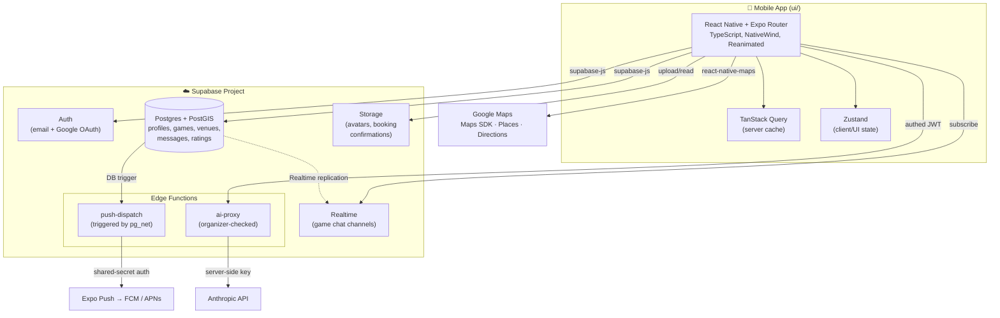

# SMASHIO

Player-matching app for the Australian market — Playo (India) style, multi-sport engine under the hood, badminton first. Core action is finding/matching with players for a game; venue is a detail on the game, not the product (SMASHIO is not a venue-booking app).

- **Platform**: iOS/Android only (React Native + Expo). No in-app web — smashio.com.au is marketing/store-links only.
- **UI direction**: CRED-style — dark theme, high creative/premium UX.
- **Status**: ABN registered (sole trader), backend fully built, UI phases 0–3 shipped. See [docs/backend-plan.md](docs/backend-plan.md) and [docs/ux-plan.md](docs/ux-plan.md).

## Architecture



**Why this shape**: sport is config, not hardcode (badminton ships first, engine assumes more sports later); AI calls are always server-side via `ai-proxy` — the client never holds an LLM key; chat is built in-house on Supabase Realtime rather than a third-party chat SDK, to keep a single vendor.

## Repo layout

```
smashio-app/
├── ui/                  # Expo Router app (React Native, TypeScript)
│   ├── app/             # File-based routes: (tabs), game, chat, wizard, onboarding, post-game
│   ├── components/      # Shared UI components
│   ├── lib/             # Supabase client, query hooks, stores, helpers
│   └── app.config.js    # Expo app config (icons, plugins, permissions)
├── supabase/            # Backend: Postgres schema, Edge Functions, config
│   ├── migrations/      # Ordered SQL migrations (schema, RLS, RPCs)
│   ├── functions/       # ai-proxy, push-dispatch (Deno Edge Functions)
│   └── seed.sql         # Local dev seed data (reference tables, sample venues)
└── docs/                # Product/tech/business docs (read before proposing features)
```

## Prerequisites

| Tool | Version | Notes |
|---|---|---|
| [Node.js](https://nodejs.org/) | 20.x | matches dev environment |
| npm | 10.x | ships with Node 20 |
| [Docker Desktop](https://www.docker.com/products/docker-desktop/) | latest | required to run Supabase locally |
| [Supabase CLI](https://supabase.com/docs/guides/cli/getting-started) | latest | `npm install -g supabase` |
| [Expo Go](https://expo.dev/go) app (iOS/Android) | latest | or an iOS Simulator / Android emulator for native testing |
| [Google Cloud](https://console.cloud.google.com/) account | — | only needed for Maps/Places API key + Google OAuth |

## 1. Clone

```bash
git clone https://github.com/ajayaradhya/smashio-app.git
cd smashio-app
```

## 2. Backend — Supabase (local)

Local Supabase runs the full stack (Postgres, Auth, Realtime, Storage, Edge Functions) in Docker — no hosted project needed to develop.

```bash
supabase start
```

First run pulls Docker images and prints local URLs + keys (API URL, anon key, service-role key, Studio URL). Keep this terminal output — the app's `.env` needs the API URL and anon key.

Apply migrations and seed data:

```bash
supabase db reset
```

This runs every file in `supabase/migrations/` in order, then `supabase/seed.sql` (reference tables, sample venues, dev fixtures).

Optional — Google OAuth locally (only needed to test "Sign in with Google"):

```bash
cp .env.example .env   # then fill in SUPABASE_AUTH_GOOGLE_CLIENT_ID / _SECRET
```

Edge Function secrets (`ai-proxy`, `push-dispatch`) are provisioned separately — see [Edge Functions](#edge-functions) below.

## 3. Mobile app — Expo

```bash
cd ui
npm install
cp .env.example .env
```

Edit `ui/.env`:

| Variable | Required | Where to get it |
|---|---|---|
| `EXPO_PUBLIC_SUPABASE_URL` | Yes | printed by `supabase start` (defaults to `http://127.0.0.1:54321`) |
| `EXPO_PUBLIC_SUPABASE_ANON_KEY` | Yes | printed by `supabase start` — same key on every machine for local dev |
| `EXPO_PUBLIC_SENTRY_DSN` | No | blank disables Sentry locally |
| `EXPO_PUBLIC_GOOGLE_MAPS_API_KEY` | No* | Google Cloud Console — enable "Maps SDK for Android" + "Places API" (legacy). Blank = grey map tiles on Android + no venue search results in the create wizard (iOS map still works via Apple Maps) |

\* Not required to boot the app; required for map tiles on Android and venue search in the game-creation wizard.

Run it:

```bash
npm start        # Expo dev server — scan QR with Expo Go, or press i / a
npm run ios       # open iOS Simulator directly
npm run android   # open Android emulator directly
npm run web       # experimental web preview (not a shipped platform)
```

## Edge Functions

| Function | Trigger | Secrets needed |
|---|---|---|
| `ai-proxy` | called by the client with the caller's session JWT | `SUPABASE_URL`, `SUPABASE_ANON_KEY`, `SUPABASE_SERVICE_ROLE_KEY`, `ANTHROPIC_API_KEY` |
| `push-dispatch` | invoked only by Postgres (`pg_net` trigger/cron), not user-facing | `SUPABASE_URL`, `SUPABASE_SERVICE_ROLE_KEY`, `PUSH_DISPATCH_KEY` (shared secret, not a Supabase JWT) |

Local Supabase auto-injects `SUPABASE_URL`/`SUPABASE_ANON_KEY`/`SUPABASE_SERVICE_ROLE_KEY`. Set the rest with:

```bash
supabase secrets set ANTHROPIC_API_KEY=sk-ant-...
supabase secrets set PUSH_DISPATCH_KEY=<random-shared-secret>
```

Serve functions locally alongside `supabase start`:

```bash
supabase functions serve
```

## Deploying to a hosted Supabase project

```bash
supabase link --project-ref <your-project-ref>
supabase db push                      # apply migrations
supabase functions deploy ai-proxy push-dispatch
supabase secrets set ANTHROPIC_API_KEY=... PUSH_DISPATCH_KEY=...
```

Then point `ui/.env` at the hosted project's URL + anon key, and provision the Google OAuth client + Maps API key for production (restrict by package name + SHA-1 before shipping — see inline comments in `ui/.env.example`).

## App store builds

Builds go through [EAS](https://docs.expo.dev/eas/) (`eas.json` not yet committed — set up via `eas build:configure` when ready to cut a release build).

## Docs

- [docs/mvp-spec.md](docs/mvp-spec.md) — MVP feature flow
- [docs/business-context.md](docs/business-context.md) — entity, naming, market context
- [docs/tech-stack.md](docs/tech-stack.md) — stack decisions + rationale
- [docs/backend-plan.md](docs/backend-plan.md) — backend build + UI integration plan
- [docs/ux-plan.md](docs/ux-plan.md) — UX polish phases

## Scope discipline

Sport engine is built generic from day one (sport = config, not hardcode), but only badminton ships in the MVP. Don't build multi-sport UI/features until the badminton loop is proven.

## License

All Rights Reserved — see [LICENSE](LICENSE). Proprietary, closed-source.
